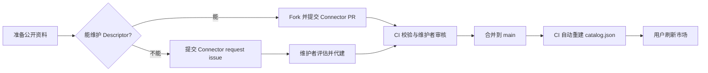

# DSH MCP Connector Registry

`dsh-mcp-connector` 的独立公共连接器目录。新卡片在本仓库通过 PR 上架，无需重新发布插件 npm 包。

## 公共目录

```text
https://raw.githubusercontent.com/duhu2000/dsh-mcp-connector-registry/main/catalog.json
```

插件会把远程目录与内置目录合并；断网或远程目录不可用时，继续使用本地内置目录。

## 当前公共连接器

`connectors/*.json` 是 Connector 源文件，根目录 `catalog.json` 是 CI 在每次合并后自动重建的公开清单和数量权威来源。请直接查看 [`catalog.json`](catalog.json)，或在仓库根目录运行以下只读命令获取实时数量及分类分布，避免 README 手写列表随批量上架而失效：

```bash
node -e "const {connectors}=require('./catalog.json'); console.log('总数:', connectors.length); console.table(connectors.reduce((n,x)=>(n[x.category]=(n[x.category]||0)+1,n),{}))"
```

插件还会把公共 Registry 与随 npm 包分发的内置目录按 `id` 合并，因此 DSH 市场页显示的去重后卡片数可能高于本仓库的 Connector 数量。连接器目录只保存公开接入参数；OAuth 授权结果、Token 和 API Key 均只保存在用户的 DSH 本机。

## 上架流程

如果您是服务商或社区贡献者，可以直接[发起连接器收录请求](https://github.com/duhu2000/dsh-mcp-connector-registry/issues/new?template=connector-request.yml)，也可以 fork 本仓库并提交 Connector PR。

首次上架请先阅读完整的[第三方连接器上架指南](docs/ONBOARDING.md)，其中包含上架前准备、两条路径、6 步操作、完整 Descriptor 模板、字段表、9 分类、4 种鉴权、Checklist 和 10 条 FAQ。



1. 复制 `connectors/example.sample.json` 为 `connectors/<connector-id>.json`，文件名必须与 `id` 完全一致。
2. 只提交公开元数据；禁止 Token、API Key、密码、Cookie 和 Client Secret。
3. 运行 `npm ci --legacy-peer-deps`，再执行 `npm test && npm run validate && npm run assets:check`。
4. 提交 PR，通过 Schema、重复 ID/ServerName、URL 和密钥审计后合并。
5. 不要手动修改或提交 `catalog.json`；合并到 `main` 后，CI 会自动重建并提交公开产物。每周健康巡检会生成探针报告 artifact。

`featured` 由维护者管理。第三方收录不代表服务商官方背书，实际权限、费用和可用性以服务商为准。

普通用户的安装、升级、分类浏览、连接与故障排查请看插件仓库的[MCP连接器用户手册](https://github.com/duhu2000/dsh-mcp-connector/blob/main/docs/USER-GUIDE.md)。Registry README 不放产品 UI 截图：上架流程图更稳定，真实产品界面统一由插件仓库维护，避免两处截图随版本演进失同步。

## 维护命令

```bash
npm run build
npm run validate
npm run probe
npm run assets:check
```

`assets:check` 会额外验证远程 Logo 的图像类型与
`Cross-Origin-Resource-Policy`，避免 URL 可访问但在 DSH Desktop 中被浏览器拦截。

完整描述格式见 [`schema/connector.schema.json`](schema/connector.schema.json)，贡献和安全规则见 [`CONTRIBUTING.md`](CONTRIBUTING.md) 与 [`SECURITY.md`](SECURITY.md)。PR 模板会要求提供服务官网、MCP 配置文档、鉴权方式和 Logo 来源，便于维护者核验。

暂不满足公开端点、鉴权或来源核验要求的候选，统一记录在[延期连接器与复核队列](docs/DEFERRED-CONNECTORS.md)，不通过猜测 URL 或放宽密钥边界凑数量。
